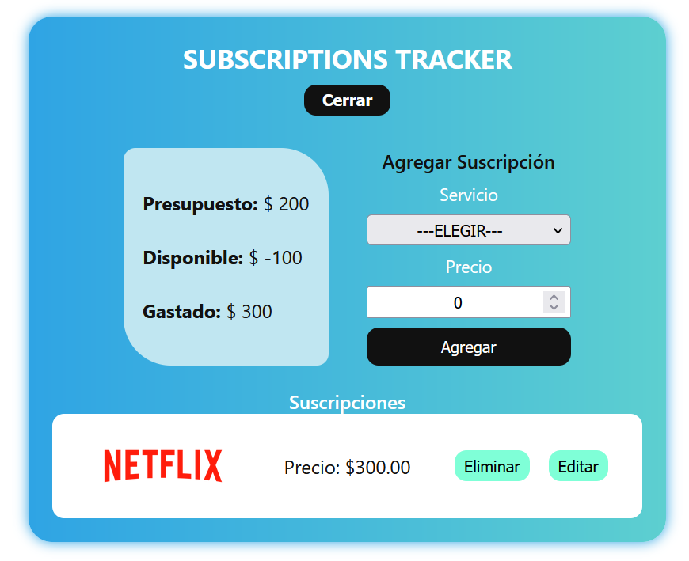

# 📺 Subscriptions Tracker

Aplicación web para gestionar y visualizar tus suscripciones mensuales, controlar tu presupuesto y tener claridad sobre tus gastos recurrentes en plataformas de streaming u otros servicios.

## ✨ Características

- ✅ Agrega nuevas suscripciones (Netflix, Spotify, HBO Max, etc.).
- ✏️ Edita y actualiza los precios o servicios existentes.
- 🗑️ Elimina servicios que ya no usas.
- 💰 Controla tu presupuesto total, gasto actual y saldo disponible.
- 🔄 Datos persistentes con `localStorage`: tus suscripciones no se pierden al cerrar el navegador.
- 🎯 Interfaz clara, rápida y responsive.

## 🖼️ Captura de Pantalla



## 🚀 Tecnologías Utilizadas

- **React** con TypeScript
- **Vite** para desarrollo rápido
- **CSS** para estilos
- **LocalStorage** para persistencia de datos
- Iconografía personalizada por servicio

## 🧠 Lógica Principal

- Cada vez que se agrega o edita una suscripción:
  - Se calcula el nuevo presupuesto gastado y disponible.
  - Se actualiza el estado global de las suscripciones.
  - Se guardan los cambios automáticamente en `localStorage`.

- Al iniciar la app:
  - Se recuperan todos los datos previamente almacenados.

## 🛠️ Instalación

```bash
# Clona el repositorio
git clone https://github.com/tu-usuario/subscriptions-tracker.git

# Entra al proyecto
cd subscriptions-tracker

# Instala dependencias
npm install

# Inicia el proyecto
npm run dev
